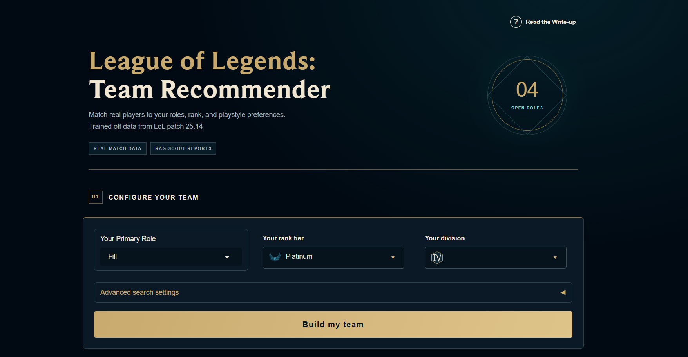
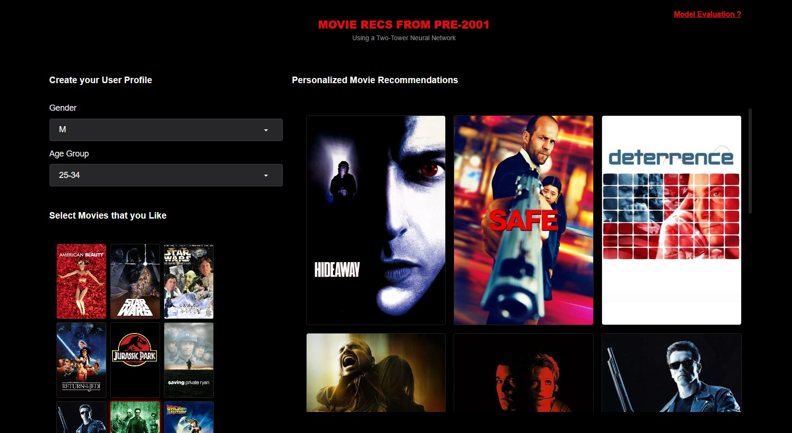

# Ragib Sakib

Machine Learning Engineer focused on Computer Vision and Recommendation Systems.  
Currently pursuing an MS in Computer Science (Artificial Intelligence) at the University of Southern California (USC).

---

### Featured ML Projects

* **[League of Legends: Team Recommender](https://github.com/RSakib/LoL-Team-Optimizer---Two-Tower-RecSys-and-RAG#league-of-legends-team-recommender)** ([Live Demo](https://lol-recsys-model-loading-page.vercel.app/))
  Two-tower teammate retrieval and joint lineup optimization with RAG-generated explanations, deployed on Google Cloud Run.

  

    
  

* **[MovieLens 1M Two-Tower Engine](https://github.com/RSakib/Pre-2001-Movie-Recs-via-Two-Tower-Neural-Network)** ([Live Demo](https://huggingface.co/spaces/RSakib/Two_Towers_MovieLens_Recommendation))
  Neural retrieval model trained with in-batch negative ranking loss, indexed with FAISS for low-latency inference.

  

    
  

---

### Technical Stack

* **Languages:** Python, C++, C#, Rust, SQL, TypeScript
* **AI/ML:** PyTorch, TensorFlow, FAISS, SAM 2, OpenCV, SciPy
* **Web & Frameworks:** React, Node.js, Gradio, SQLite

---

### Connect with Me

* **Website:** [ragibsakib.dev](https://ragibsakib.dev)
* **LinkedIn:** [linkedin.com/in/ragibsakib](https://linkedin.com/in/ragibsakib)
* **Hugging Face:** [huggingface.co/RSakib](https://huggingface.co/RSakib)
* **Email:** Ragibsakib2002@gmail.com
